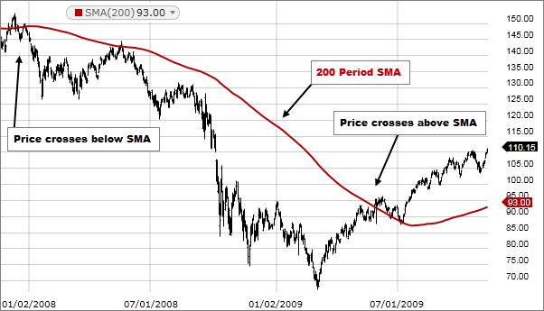
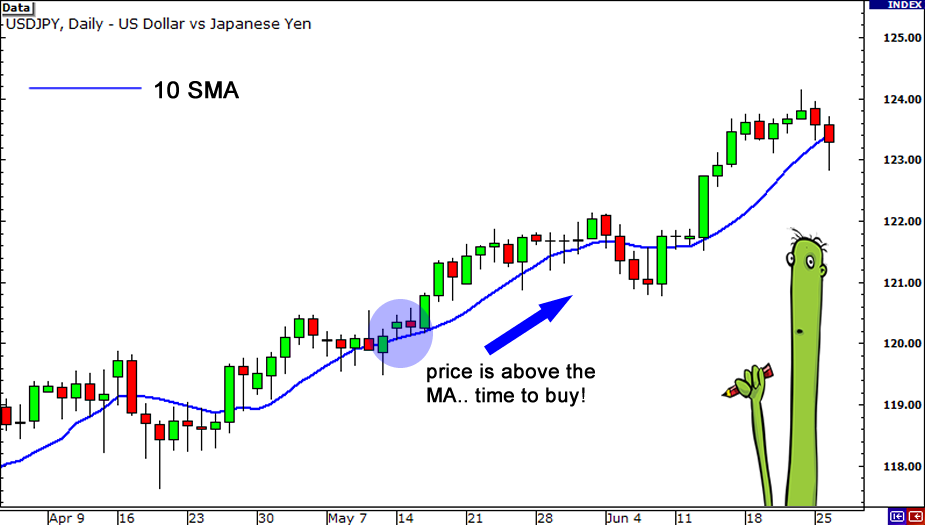
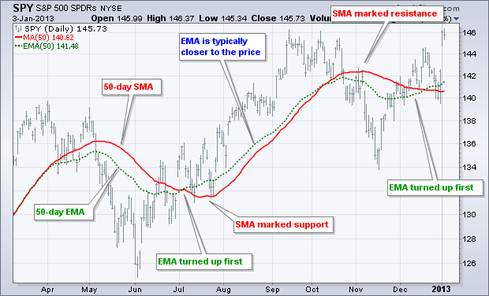

```{r echo=FALSE, include=FALSE, warning=FALSE}
if(!require(fpp))install.packages("fpp"); require(fpp)
if(!require(astsa))install.packages("astsa"); require(astsa)
if(!require(quantmod))install.packages("quantmod"); require(quantmod)
if(!require(latex2exp))install.packages("latex2exp"); require(latex2exp)
if(!require(ggplot2))install.packages("ggplot2"); require(ggplot2)
library(knitr)
```


## Forecasting Data and Methods

The appropriate forecasting methods depend largely on what data are available.

1. If there are no data available, or if the data available are not relevant to the forecasts, then \textbf{qualitative} forecasting methods must be used. These methods require the use of well-developed judgemental forecast methods. 


2. \textbf{Quantitative} forecasting can be applied when two conditions are satisfied:

i. numerical information about the past is available;
ii. it is reasonable to assume that some aspects of the past patterns will continue into the future.

## Forecasting Data and Methods 
### Quantitative forecasts
Most quantitative prediction problems use either time series data or cross-sectional data (collected at a single point in time). 

\bigskip In this module we are concerned with forecasting future data, and we concentrate on the time series domain.

## Time Series Explained

\small
> Often in forecasting, a key step is knowing when something can be forecast accurately, and when forecasts will be no better than tossing a coin. Good forecasts capture the genuine patterns and relationships which exist in the historical data, but do not replicate past events that will not occur again.
\hfill ~Rob Hyndman
\normalsize

A time series is a sequence of measurements over time, usually obtained at regular, equally spaced intervals

- Every minute
- Hourly
- Daily
- Weekly
- Monthly
- Quarterly
- Yearly


## Examples of Time Series Models

```{r echo=FALSE, warning=FALSE,include=FALSE,message=FALSE}
start_date <- as.Date("2017-01-02")
end_date <- as.Date("2019-10-01")
getSymbols("DJI", src = "yahoo", from = start_date, to = end_date)
getSymbols("CPIAUCSL", src = "FRED", from = start_date, to = end_date)
```

```{r plots, echo=FALSE, warning=FALSE,message=FALSE}
par(mfrow=c(2,2),bg="white")

tsplot(oil,main= "Crude oil, WTI spot price FOB" , ylab="($ per barrel)",xlab="",lwd=2,col="green4")

tsplot(soi,main= "Southern Oscillation Index (SOI)" , ylab="",xlab="",lwd=2)
text(1970, .91, "COOL", col="cyan4",font = 2)
text(1970,-.91, "WARM", col="darkmagenta",font=2)

tsplot(as.zoo(DJI$DJI.Close),main = "Dow Jones Index",ylab= "Closing Price",xlab = "",lwd = 2, col="blue")

tsplot(as.zoo(CPIAUCSL),main = "US Consumer Price Index",ylab= "Index",xlab = "",lwd = 2, col="red")
#dev.off()

```

## Components of a Time Series

-  __Trends__ (exists when there is a longrun increase or decrease in the data.)
    - Linear
    - Nonlinear
  
- __Seasonality__ (occurs when a time series is affected by seasonal factors such as the time of the year or the day of the week.)
  - Seasonality is __always of a fixed and known frequency__.
      - These patterns repeat themselves within a year.
      - These fluctuations are usually due to economic conditions, and are often related to the “business cycle”.
      - The duration of these fluctuations is usually at least 2 years.
  
- __Cycles__
  - Rises and falls that are not of a fixed frequency
  


## Components of a Time Series

### Additive
If we assume an additive decomposition, then we can write
$$y_{t} = S_{t} + T_{t} + R_t,$$
 
where $y_t$ is the data, $S_t$ is the seasonal component, $T_t$ is the trend-cycle component, and $R_t$ is the remainder component, all at period $t$.

### Multiplicative
A multiplicative decomposition would be written as
$$y_{t} = S_{t} \times T_{t} \times R_t,$$


<!-- ## Components of a Time Series -->

<!-- ### Log Transformation -->
<!-- An alternative to using a multiplicative decomposition is to first transform the data until the variation in the series appears to be stable over time, then use an additive decomposition.  -->
<!-- A log transformation of the data would allow us to achieve this. -->
<!-- $$y_{t} = S_{t} \times T_{t} \times R_t \quad \mbox{is equivalent to}\quad \log y_t = \log S_t + \log T_t + \log R_t$$ -->


<!-- - The additive decomposition is the most appropriate if the magnitude of the seasonal fluctuations, or the variation around the trend-cycle, does not vary with the level of the time series.  -->

<!-- - When the variation in the seasonal pattern, or the variation around the trend-cycle, appears to be proportional to the level of the time series, then a multiplicative decomposition is more appropriate.  -->

<!-- - Multiplicative decompositions are common with economic time series. -->

## Linear trend models
$$Y_t = a + b\cdot t + e_t $$

```{r trends_plots, echo=FALSE, message=FALSE, warning=FALSE,fig.asp=0.45}
par(mfrow=c(1,3),bg="white")

tsplot(as.zoo(CPIAUCSL),main = "US Consumer Price Index",ylab= "Index",xlab = "",lwd = 2, col="black")
tsplot(jj,main = "Johnson & Johnson Earnings",ylab= "Earnings per share",xlab = "",lwd = 2, col="green4")
tsplot(austa,main = "Total International Visitors to Australia",ylab= "",xlab = "",lwd = 2, col="blue")
#tsplot(a10,main = "Antidiabetic drug sales",ylab= "$ million" ,xlab = "",lwd = 2, col="red4")
```

## Nonlinear Trend

```{r, echo=FALSE,fig.asp=0.6}
imps <- ts(exp((0:30/4)^1/2),end= c(2018,1),frequency = 1)
tsplot(imps,type = "o",main="Volume of Imports",ylab="Imports(Millions)",xlab="",lwd=2)
```

## Transforming time series with nonlinear trends

$$\log Y_t = a + b\cdot t +e_t$$
Our transformed data now looks like:

```{r, echo=FALSE,fig.asp=0.45}
tsplot(log(imps),type = "o",main="Logged Imports",ylab="log(Imports)",xlab="",lwd=2)
```

## Models with Trends and Seasonality

```{r trends_season, echo=FALSE, message=FALSE, warning=FALSE,fig.asp=0.35}
# par(mfrow=c(1,3),bg="white")
tsplot(a10,main = "Monthly anti-diabetic drug sales",ylab= "$ million" ,xlab = "",lwd = 2, col="red4")
```
We can see a clear and increasing trend. There is also a strong seasonal pattern that increases in size as the level of the series increases. 

The sudden drop at the start of each year is caused by a government subsidization scheme that makes it cost-effective for patients to stockpile drugs at the end of the calendar year. 

Any forecasts of this series would need to capture the seasonal pattern, and the fact that the trend is changing slowly.

## Model Building
For the Monthly Anti-diabetic drug sales data:

  - What kind of trends do you notice?
    - Linear
    - Logarithmic
    - Polynomial
  - How can we smooth the data?
  - How do we model the seasonality observed in the data?
  
## Monthly Anti-diabetic drug sales data with Linear Trend
```{r linear_trend_drug, echo=FALSE, message=FALSE, fig.asp=0.5}
# par(mfrow=c(1,3),bg="white")
#par(mfrow=2:1)
t <- 1: length(a10)
fit <- lm(a10~t)
r.2 <- round(summary(fit)$r.squared,3)
ts.plot(a10,fit$fitted,main = "Monthly anti-diabetic drug sales",ylab= "$ million" ,xlab = "",lwd = 2, col=c("red4","blue"))
text(1993,27, TeX("y = 1.131 + 0.093t"),font=2)
text(1992.5,23, TeX("$R^2$ = 0.855"),font=2)
```
**Immediately we see that a simple time trend explains almost 86% of the variations in the monthly sales of this anti-diabetic drug.**

## Modeling a nonlinear trend

### Increasing Series
If the series appears to be changing at an __increasing rate__ over time, we can use a model with a log transformation of the __data__ as we learned earlier. 
$$\log Y_t = a + b\cdot t +e_t$$

Equivalently, we can use an exponential model
$$ Y_t = \exp\{a + b\cdot t +e_t\}$$

### Decreasing Series
If the series appears to be changing at an __decreasing rate__ over time, we can use a model with log transformation of the __time trend__. 
$$ Y_t = a + b\cdot \log (t) +e_t$$

## Monthly Anti-diabetic drug sales data with an Exponential Trend

```{r exp_trend_drug, echo=FALSE, message=FALSE, fig.asp=0.5}
# par(mfrow=c(1,3),bg="white")
#par(mfrow=2:1)
fite <- lm(log(a10)~t)
r.2e <- round(summary(fite)$r.squared,3)
ts.plot(a10,exp(fite$fitted),main = "Monthly anti-diabetic drug sales",ylab= "$ million" ,xlab = "",lwd = 2, col=c("red4","blue"))
text(1993,27, TeX("$\\log$ (y) = 1.258 + 0.093t"),font=2)
text(1992.5,23, TeX("$R^2$ = 0.927"),font=2)
```
**From the $R^2$ we can conclude that the exponential trend does a good job of explaining the variations in the monthly sales of this anti-diabetic drug.**


<!-- ## Monthly Anti-diabetic drug sales data with an Logarithmic Trend -->

<!-- ```{r log_trend_drug, echo=FALSE, message=FALSE, fig.asp=0.5} -->
<!-- # par(mfrow=c(1,3),bg="white") -->
<!-- #par(mfrow=2:1) -->
<!-- fitl <- lm(a10~log(t)) -->
<!-- r.2l <- round(summary(fitl)$r.squared,3) -->
<!-- ts.plot(a10,fitl$fitted,main = "Monthly anti-diabetic drug sales",ylab= "$ million" ,xlab = "",lwd = 2, col=c("red4","blue")) -->
<!-- text(1993,27, TeX("y = -9.616 + 4.684 $\\log$t"),font=2) -->
<!-- text(1992.5,23, TeX("$R^2$ = 0.564"),font=2) -->
<!-- ``` -->
<!-- **The Logarithmic trend does not do a good job of explaining the variations in monthly sales of the drug. Also, it yields some predictions that are not consistent with the data.** -->


## Modeling a Nonlinear Trend

-  It is quite common to model trends using polynomials of varying orders:
  - First Order (Linear)
$$\log Y_t = a + b\cdot t + e_t$$
  - Second Order (Quadratic)
$$\log Y_t = a + b\cdot t + c\cdot t^2 + e_t$$
  - Third Order (Cubic)
$$\log Y_t = a + b\cdot t + c\cdot t^2 + d\cdot t^3 + e_t$$

## Monthly Anti-diabetic drug sales data with a Quadratic Trend
```{r quad_trend_drug, echo=FALSE, message=FALSE, fig.asp=0.5}
# par(mfrow=c(1,3),bg="white")
#par(mfrow=2:1)
ts <- t^2
fitq <- lm(a10~t+ts)
r.2q <- round(summary(fitq)$r.squared,3)
ts.plot(a10,fitq$fitted,main = "Monthly anti-diabetic drug sales",ylab= "$ million" ,xlab = "",lwd = 2, col=c("red4","blue"))
text(1994.25,27, TeX("y = 3.968 + 0.011 $\\log$(t) + 0.0004 $\\log (t^2)$"),font=2)
text(1992.5,23, TeX("$R^2$ = 0.899"),font=2)
```


## Moving Average

- Moving averages are one of the core indicators in technical analysis, and there are a variety of different versions.
- One of the most common ways we examine trend in market data is using simple moving averages. 
- In this approach, we forecast the value of the current time period using the last $m$ consecutive observations.

- For example, a 4-point moving average would be computed as:
$$\bar{y}_{MA(4)} = \frac{y_t + y_{t-1} + y_{t-2} + y_{t-3}}{4}$$
- The average eliminates some of the randomness in the data, leaving a smooth trend-cycle component.

## Moving Average
\tiny

\begin{table}
\caption{Annual electricity sales to residential customers in South Australia. 1989–2008}
\begin{tabular}{|l|p{1cm}|l|}
\hline
Year & Sales (GWh) & 4-point    \\\hline
1989 & 2354.34     &          \\
1990 & 2379.71     &          \\
1991 & 2318.52     &          \\
1992 & 2468.99     & 2380.39  \\
1993 & 2386.09     & 2388.328 \\
1994 & 2569.47     & 2435.768 \\
1995 & 2575.72     & 2500.068 \\
1996 & 2762.72     & 2573.5   \\
1997 & 2844.50     & 2688.103 \\
1998 & 3000.70     & 2795.91  \\
1999 & 3108.10     & 2929.005 \\
2000 & 3357.50     & 3077.7   \\
2001 & 3075.70     & 3135.5   \\
2002 & 3180.60     & 3180.475 \\
2003 & 3221.60     & 3208.85  \\
2004 & 3176.20     & 3163.525 \\
2005 & 3430.60     & 3252.25  \\
2006 & 3527.48     & 3338.97  \\
2007 & 3637.89     & 3443.043 \\
2008 & 3655.00     & 3562.743 \\\hline
\end{tabular}
\end{table}

---
```{r, echo=FALSE}
data2 <- data <- NA 
for (i in 4:length(elecsales)){ # Calculating 4 point MA
data[i] <- sum(elecsales[i:(i-3)])/4
}
for (i in 8:length(elecsales)){ # Calculating 8 point MA
data2[i] <- sum(elecsales[i:(i-7)])/8
}

data.ts <- ts(data,start=c(1989,1),frequency=1)
data2.ts <- ts(data2,start=c(1989,1),frequency=1)
par(mfrow=c(1,2))
ts.plot(elecsales,data.ts,main="Annual Electricity Sales: South Australia", lwd=2,col=c(4,3),type="o",ylab="GWh",xlab="")
mtext("4-point MA",side=3,col="red",cex=0.9)
legend("topleft", legend=c("Data","4-point MA"),col = c(4,3),lty=1:2,pch=c(1,1))
grid()

ts.plot(elecsales,data2.ts,main="Annual Electricity Sales: South Australia", lwd=2,col=c(4,3),type="o",ylab="GWh",xlab="")
mtext("8-point MA",side=3,col="red",cex=0.9)
legend("topleft", legend=c("Data","8-point MA"),col = c(4,3),lty=1:2,pch=c(1,1))
grid()

```

## Simple Moving Averages

```{r, echo=FALSE,fig_crop= TRUE, out.width=c("45%","45%"),fig.show='hold'}


```

MAs will prove very useful in your technical analyses of commodity prices. We often use them to:

1. Determine the direction of a trend. If the moving average is rising, it makes sense to buy, if it is falling, it’s better to sell.
2. Round periods Moving Averages (50, 100, 200) can be taken as dynamic support and resistance levels.
3. The Moving Average Convergence Divergence (MACD) uses fast- and slow-moving averages to get a signal of a possible trend reversal, whether it’s bullish or bearish.

## Exponential Moving Averages (EMA)

- An exponential moving average is a weighted average that assigns positive weights to the current and past values of the time series.

- It gives greater weight to more recent values, and __the weights decrease exponentially__ as the series goes farther back in time.

  - Data points closest to today's value will do a better job at explaining today's price so we will assign them greater weights than past data further away. 

\vskip -0.25in
\begin{align*}
S_1 & = Y_1\\
S_t & = wY_t + (1-w)S_{t-1}\\
    & =  wY_t + w(1-w)Y_{t-1} +w(1-w)^2 Y_{t-2} + \ldots
\end{align*}

## Exponential Moving Averages (EMA)

If $w = 0.5$


\begin{align*}
\color{red}{S_1} & = \color{red}{Y_1}\\
\color{blue}S_2 & = \color{blue}0.5Y_2 + (1-0.5)\color{red}S_1 \color{black} = \color{blue}0.5Y_2 + 0.5\color{red}{Y_1} \\
\color{purple}S_3 & = \color{purple}0.5Y_3 + (1-0.5)\color{blue}{S_2} \color{black}= \color{purple}0.5Y_3 + 0.5\color{blue}\big[(0.5)Y_2 + 0.5\color{red}Y_1\big]\\
               &  = \color{purple}0.5Y_3 + 0.25Y_2 + 0.25Y_1\\
  S_4  & =  0.5Y_4 + (1-0.5)\color{purple}S_3 \color{black} = 0.5Y_4 + 0.5\color{purple}\big[\color{purple}0.5Y_3 + 0.25Y_2 + 0.25Y_1\big]\\
             & = 0.5Y_4 + 0.25Y_3 + 0.125Y_2 + 0.125Y_1
\end{align*}

## Exponential Moving Average (EMA)

```{r, echo=FALSE,fig.crop = TRUE, out.width="70%",fig.align="center"}

```  

### Exponential Smoothing

- The weight we chose will affect the smoothness of the predicted value.

  - Smaller $w$'s results in a smoother plot of predicted values.

  - As $w$ gets closer to 1, the closer the prediction is to the original series.


## Measuring Forecast Errors
• An actual value of time series observed at time t $$Y_{t}$$

• A forecast value of $Y_{t}$ $$\widehat{Y}_{t}$$

• The forecast error $$e_{t} = Y_{t}-\widehat{Y}_{t}$$

• The best model should minimize forecast errors 

\begin{equation}
\label{eqn:min_error}
\underset{\hat{Y}_{t}}{\min}\:\sum_{t=1}^{T}e_{t}
\end{equation}

## Measuring Forecast Errors

\begin{equation}
\tag{\ref{eqn:min_error}}
\underset{\hat{Y}_{t}}{\min}\:\sum_{t=1}^{T}e_{t}
\end{equation}

The potential problem with Eqn(\ref{eqn:min_error}) is that forecasts with large errors but different signs can give minimum errors. For example, for two forecast errors, (-6,6), the sum of these errors is zero. For two forecast errors, (1,1.2), the summation of these errors are 2.4. The latter should be chosen as better forecasts. However, we will end up choosing the former one.

Next, we will look at some of the methods that we use to better inform our judgement.

## Measuring Forecast Errors
- Method (1) - Mean Absolute Deviations (MAD)
\[MAD=\frac{1}{T}\sum_{t=1}^{T}\left|Y_{t}-\widehat{Y}_{t}\right|\]

- Method (2) - Mean Squared Error (MSE) 
\[MSE=\frac{1}{T}\sum_{t=1}^{T}\left(Y_{t}-\widehat{Y}_{t}\right)^{2}\]

- Method (3) - Root Mean Squared Error (RMSE) 
$$RMSE=\sqrt{MSE}=\sqrt{\frac{1}{T}\sum_{t=1}^{T}\left(Y_{t}-\widehat{Y}_{t}\right)^{2}}$$
<!-- ## Measuring Forecast Errors -->
<!-- - Method (4) - Mean Absolute Percentage Error (MAPE)  -->
<!-- \[ MAPE=\frac{1}{T}\sum_{t=1}^{T}\frac{\left|Y_{t}-\widehat{Y}_{t}\right|}{\left|Y_{t}\right|} \] -->

<!-- -Method (5) - Mean Percentage Error (MPE)  -->
<!-- \[ MPE=\frac{1}{T}\sum_{t=1}^{T}\frac{\left(Y_{t}-\hat{Y}_{t}\right)}{\left|Y_{t}\right|} \] -->

## Modeling Seasonality
```{r cemment_data, echo=FALSE,include=FALSE}
if(!require(fpp2))install.packages("fpp2"); require(fpp2)
```
- The simplest way to model seasonality is using a dummy or indicator variable in a regression model.
- Let us attempt this for a quarterly data series of cement production. 
```{r cemment_plot, echo=FALSE,include=TRUE,fig.asp="30%",fig.height=3.5}
tsplot(qcement, col="blue", lwd=2,xlab="", ylab=" (in millions of tonnes)",main = "Total quarterly production of Portland cement in Australia")
```

Clearly, there is a trend and seasonality. As such, we can model this data as:\footnote{Notice we left out one of the dummies. This is important in order to avoid the \textit{dummy variable trap.}}
\begin{equation}
\label{eqn:season} Y_t = a + bt + c_1Q_1 + c_2Q_2 + c_3Q_3 + e_t
\end{equation}

## Modeling Seasonality

\begin{equation}
\tag{\ref{eqn:season}} Y_t = a + bt + c_1Q_1 + c_2Q_2 + c_3Q_3 + e_t
\end{equation}
here
\begin{align*}
Q_1 & = 
\begin{cases} 
1 & \mbox{if quarter 1} \\
0 & \mbox{if quarter 2,3,4}
\end{cases} \\
Q_2 & = 
\begin{cases} 
1 & \mbox{if quarter 2} \\
0 & \mbox{if quarter 1,3,4}
\end{cases}\\
Q_3 & = 
\begin{cases} 
1 & \mbox{if quarter 3} \\
0 & \mbox{if quarter 1,2,4}
\end{cases}
\end{align*}

## Cement Production Data forecasted using Trends and Seasonality

```{r cement_lm, echo=FALSE,fig.height=5, fig.width=8}
t <- 1: length(qcement)
dQ <- seasonaldummy(qcement) # Quickly create the 3 seasonal dummies
lm_cement <- lm(qcement~t+dQ)
fit_cement <- lm_cement$fitted
r_cement <- summary(lm_cement)$r.squared
cc2 <- lm_cement$coef
nx <- c("t","Q1","Q2","Q3")
ts.plot(qcement,fit_cement,col=c(4,6),main = "Total Quarterly production of Portland cement in Australia",lwd=c(1.5,2),ylab="",xlab="")
legend("topleft", legend=c("Data","Predicted"),col = c(4,6),lwd=c(1.5,2),bty = "n")
text(1993,0.7, TeX("y_t = 0.634 + 0.008t - 0.192Q_1 - 0.025Q_2 + 0.028Q_3"))
text(1993,0.5, TeX('$R^2 = 0.940$'))

```
